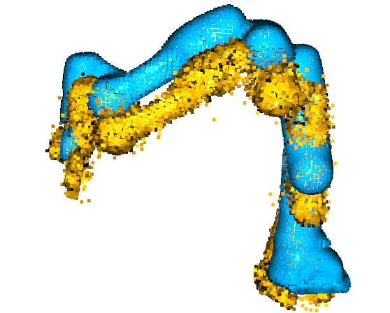

# 🧠 Scene Gaussian Reconstruction and Augmented Demonstration Pipeline

This project, jointly developed by Xi'an Jiaotong University and Huawei, provides a complete pipeline for generating editable 3D Gaussian reconstructions of entire manipulation scenes. The reconstructed scenes are rendered from fixed camera perspectives and used to train Vision-Language-Action (VLA) models. By leveraging the editability of Gaussian splats, this pipeline enables augmentation from a single collected demonstration into infinite variations by modifying object pose, lighting, object types, and scene backgrounds.

---

## ✅ Step 1: Run COLMAP and Gaussian Splatting for Initial 3D Reconstruction

### 1.1 Clone the Repository and Setup the Environment

```bash
git clone https://github.com/XJTU-RoboLab/Scene_Reconstruction.git --recursive
cd Scene_Reconstruction
conda env create --file environment.yml
conda activate gaussian_splatting
```

### 1.2 Convert Video to Image Sequence

```bash
ffmpeg -i your_video_dir -vf fps=10 Scene_Reconstruction/data/input/image%d.png
```


### 1.3 Image Preprocessing and COLMAP Structure Generation

```bash
cd Scene_Reconstruction
python convert.py -s Scene_Reconstruction/data --resize
```

### 1.4 Run Depth Estimation and Generate Scaling Factors

> Compress align/ directory to align.zip and upload to the working directory before running the following commands.

```bash
pip install git+https://github.com/huggingface/transformers.git
python Scene_Reconstruction/depth_gen.py --input_path /dev/shm/GS_data/data/input
python utils/make_depth_scale.py \
    --base_dir data/ \
    --depths_dir data/depth
```

### 1.5 Train Gaussian Splatting on the Scene

```bash
python train.py -s data \
                -m output/data \
                -d data/depth \
                -r 1
```

> Replace with your scene folder if needed. The `-r` option controls the downsampling factor for training resolution.

### 1.6 (Optional) Visualize Results Using SIBR Viewer

```bash
cd Scene_Reconstruction/SIBR_viewers/install/bin
./SIBR_gaussianViewer_app -m Scene_Reconstruction/output/scene
```

---

## ✅ Step 2: Semantic Filtering via SuperSplat

Use the online SuperSplat editor to segment the Gaussian point cloud into meaningful components:

* Robot arm
* Table surface
* Manipulated object

Editor URL: [https://superspl.at/editor/](https://superspl.at/editor/)

⚠️ **Important: Do not apply any transformation (translation, rotation, or scale) to the Gaussian points.**

> Save outputs to: `Scene_Reconstruction/point_cloud/`

---

## ✅ Step 3: Estimate Initial Transformation Matrix

### 3.1 Generate Initial Transform

```bash
cd align
python initialize_matrix.py --gs_path Scene_Reconstruction/point_cloud/fr3.ply
```

<details>
<summary>Click to expand and view the pose alignment diagram.</summary>



</details>


### 3.2 Perform Coarse Alignment using ICP

```bash
python icp_alignment.py
```

<details>
<summary>Click to expand and view the pose alignment diagram.</summary>


</details>


* Inspect visual output to verify alignment.
* Use the matrix generated by `initialize_matrix.py` as the initial value for `trans_init` in `icp_alignment.py`.
* Also update the initial pose `initpose` in `scene_target.py` accordingly.


---

## ✅ Step 4: Neural Refinement of Alignment Matrix

Use a small neural network to refine the coarse alignment.

```bash
python align/network_alignment.py --gs_path gaussian-splatting/point_cloud/fr3.ply
```

The alignment network is defined in `network_alignment.py`, with the optimized result stored in:

```python
self.transformed_matrix = nn.Parameter([xyz + xyzw])
```

The optimized pose is returned from `.pth` and assigned to `self.transformed_matrix`.

---

## ✅ Step 5: Apply Transformation to Each Gaussian Component

Transform the separated Gaussian point clouds (robot, table, object) using the optimized alignment matrix:

```bash
python align/utils_2.py
python align/obj_posed.py
```

<details>
<summary>Click to expand and view the pose alignment diagram.</summary>


</details>


⚠️ **Important: Follow the steps above to process the desktop and objects; objects need to be rescanned to obtain Gaussian.**


---

## ✅ Step 6: Parse Robot Links from URDF

Split robot into individual links using URDF information:

```bash
python get_link_mesh.py
```

> Each link mesh will be saved with its local origin set to `[0, 0, 0]`.

---

## ✅ Step 7: Record Demonstration Trajectory

Capture one full motion trajectory including:

* `ee_pose`: End-effector pose
* `q_pos`: Joint angles
* `gripper`: Gripper open/close status

Trajectory data should be stored in `.h5` format. Key frame indices are set in:

```
python generate_demo.py
```

---

## ✅ Step 8: Novel Demonstration Generation

Ensure all required calibration inputs are available in the target folder, then run:

```bash
git clone https://github.com/OpenRobotLab/RoboSplat.git
conda create -n robosplat python=3.10 -y
conda activate robosplat
cd RoboSplat
pip install -r requirements.txt
python data_aug/generate_demo.py \
    --image_size 224 \
    --save True \
    --save_video True \
    --ref_demo_path data/source_demo/real_000000.h5 \
    --xy_step_str '[10, 10]' \
    --augment_lighting False \
    --augment_appearance False \
    --augment_camera_pose False \
    --output_path data/generated_demo/pick_100
```

